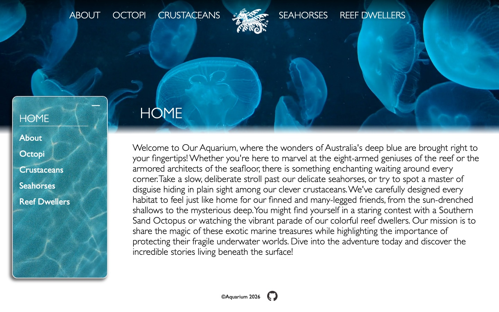
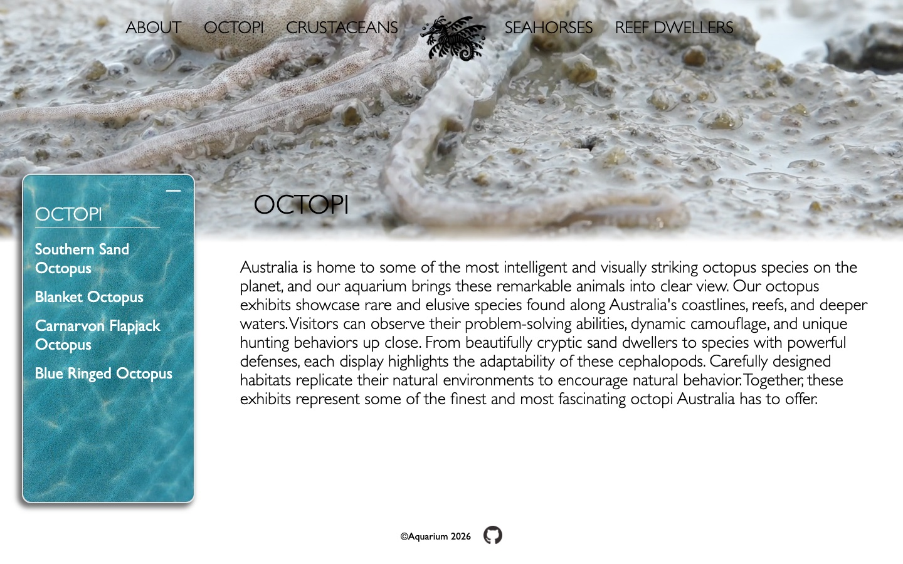
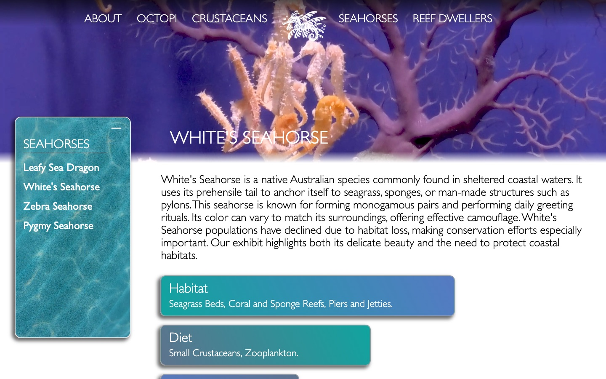
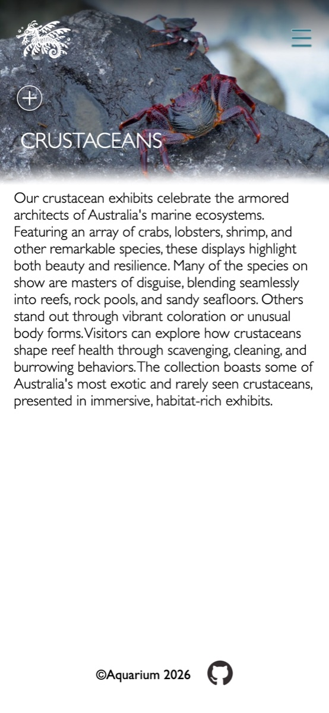

# Aquarium

A website for a fictional Australian aquarium, with a section for each group of animals and a
page for each species. Built as a school group project with
[Sofia Runsten](https://github.com/sofiluran).

**Live demo:** [aquarium-assignment.vercel.app](https://aquarium-assignment.vercel.app)



## Features

- Server-rendered pages for four animal groups (octopi, crustaceans, seahorses, reef
  dwellers) plus home and about
- A page for every species with its habitat, diet and background, loaded from a query string
  like `/seahorses/species?name=white's-seahorse`
- Full-width video headers for each section
- A collapsible sidebar that lists the species in the current section
- GSAP animations for the sidebar, text and a bubble effect
- Responsive layout with a hamburger menu on mobile

| Section page | Species page |
|---|---|
|  |  |



## Tech stack

- Node.js with Express 5
- EJS templates with shared partials for the header, sidebar, content and footer
- Express Router, one router per animal group
- GSAP
- Plain CSS
- Deployed on Vercel

## How it's built

All content lives in `data/creatures.js`: one array for the groups and one for each group's
species. Each route finds the right group or species and passes it to a single page template,
`views/pages/index.ejs`, which builds the page from partials. Adding a new species only means
adding an object to the data file.

## Working together

We planned the work as numbered tasks and built each one on its own feature branch
(`feature/006`, `feature/024/media-queries`, `feature/025/animations` and so on), merging
through `develop` and `staging` before `main`.

- **Sofia:** Express setup and routes, footer partial, images, responsive layout and the
  hamburger menu
- **Seth:** the data set, shared helper functions for the routes, the octopus router, the
  sidebar and header logic, the light/dark header theme over the videos, GSAP animations,
  mobile nav styling and videos

## Running locally

```bash
npm install
npm run dev
```

Then open [localhost:3456](http://localhost:3456).

The videos in `public/videos` add up to about 200 MB, so the first clone takes a while.
